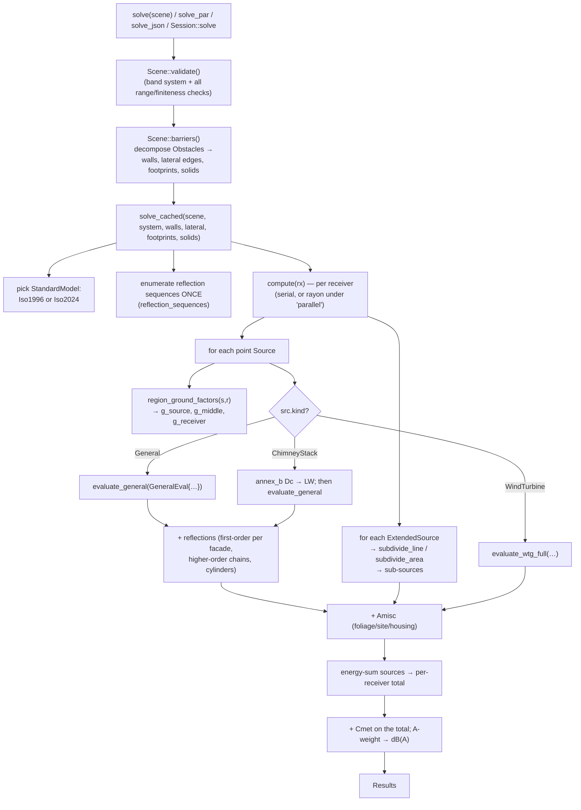
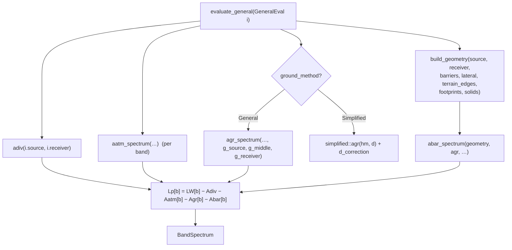
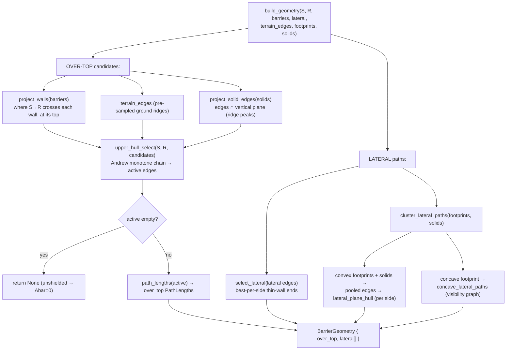

# `iso9613-core` — Reviewer's Guide

A map of the engine for a manual code review: the architecture, the end-to-end
call flow (with diagrams), a function reference grouped by the physics term each
one computes, and an index of where the recent review-fixes live. Written for a
domain expert (you know the acoustics) verifying the Rust implementation.

Companion docs:
- **`rust-debugging-primer.md`** — how to step through / instrument Rust if you've
  not debugged it before.
- **`iso9613-solver-review-fixes-plan.md`** + **`review-2026-07-09-findings.json`**
  — the review that drove the recent changes.
- The `README.md` — build/test/consume instructions.

> **How to read the code alongside this.** Every function below is cited as
> `file.rs:line` (approximate — search the function name if it has drifted). The
> single most important file is `scene/mod.rs` (the API + the pipeline); the most
> intricate is `iso9613/barrier/path.rs` (diffraction geometry).

---

## 1. What the engine computes

Per receiver, per source, per frequency band:

```
Lp = LW + Dc − Adiv − Aatm − Agr − Abar − Amisc   (+ Cmet on the total)
```

then energy-sums over sources and specular reflections, and A-weights to a total
`dB(A)`. Each term is a module:

| Term | Meaning | Module | ISO clause |
|---|---|---|---|
| `LW` | source sound power per band | (input) | — |
| `Dc` | directivity (chimney) | `iso9613/annex_b.rs` | Annex B |
| `Adiv` | geometric divergence (spreading) | `iso9613/divergence.rs` | 7.1 |
| `Aatm` | atmospheric absorption | `iso9613/atmosphere.rs` | 7.2 / ISO 9613-1 |
| `Agr` | ground effect | `iso9613/ground/` | 7.3 |
| `Abar` | barrier / building diffraction | `iso9613/barrier/` | 7.4 |
| `Amisc` | foliage / industrial / housing | `iso9613/misc.rs` | Annex A |
| reflections | image-source specular | `iso9613/reflection.rs` | 7.5 |
| `Cmet` | long-term meteorological | `iso9613/meteorology.rs` | §8 / Annex C |
| WTG | wind-turbine specifics | `iso9613/annex_d.rs` | Annex D |

---

## 2. Architecture at a glance

```
crates/
  iso9613-core/   ← THE crate under review (pure f64, no I/O)
    src/
      lib.rs             re-exports
      units.rs           Vec3 (e=east, n=north, z=up; all metres, absolute)
      spectrum.rs        BandSystem (Octave 10 / ThirdOctave 31), BandSpectrum,
                         EXACT ISO-266 centre frequencies, A-weighting
      scene/
        mod.rs           PUBLIC API: Scene, Obstacle, Source, validate(),
                         solve(), solve_par(), solve_json(), Session; the
                         per-receiver/per-source PIPELINE (solve_cached)
        extent.rs        line/area source → point sub-sources
      standards/
        mod.rs           EditionSpec (1996 vs 2024 as data), StandardModel trait,
                         GeneralEval, evaluate_general() (the scoring kernel)
      iso9613/
        mod.rs           evaluate_free_field / _with_ground / _with_barriers
                         (thin compat entry points used by the WASM shim + tests)
        divergence.rs    Adiv
        atmosphere.rs    Aatm (ISO 9613-1 alpha)
        ground/          Agr: mod (dispatch), general (Table-3 method),
                         simplified (§7.3.2), functions (a'/b'/c'/d' shapes)
        barrier/         Abar: path (geometry engine), diffraction (scoring:
                         Dz/C3/Kmet/caps), mod (abar_spectrum combine)
        reflection.rs    image sources, Fresnel gate, higher-order, cylinders
        terrain.rs       Heightfield raster → screening edges + mean height
        misc.rs          Amisc kernels (Annex A tables)
        meteorology.rs   Cmet
        annex_b.rs       chimney directivity Dc
        annex_d.rs       wind-turbine evaluation
  iso9613-wasm/   thin flat-API shim for the existing web app (compat)
  iso9613-py/     PyO3 bindings (workspace-excluded)
```

### Core data types (read these first)

| Type | File | What it is |
|---|---|---|
| `Vec3 { e, n, z }` | `units.rs` | a point/vector in metres, **absolute** coords |
| `BandSystem` | `spectrum.rs` | `Octave` (10 bands, 16 Hz–8 kHz) or `ThirdOctave` (31). Physics uses **exact** ISO-266 centres (`centres_exact()` → 7943 Hz, not the 8000 label) |
| `BandSpectrum { system, bands }` | `spectrum.rs` | a per-band `Vec<f64>` (dB) tied to a system |
| `Scene` | `scene/mod.rs` | the whole input (sources, receivers, ground, obstacles, reflectors, terrain, atmosphere, settings) — `serde`-(de)serializable |
| `Obstacle` | `scene/mod.rs` | `Wall` (thin screen), `Building` (2-D footprint + flat roof), `Solid` (3-D wireframe: pitched roofs / arbitrary) |
| `Results { per_receiver }` | `scene/mod.rs` | per-receiver → per-source bands + A-weighted total |
| `WallBarrier`, `LateralEdge`, `FootprintLateral`, `Solid3D`, `DiffractionEdge` | `barrier/path.rs` | the geometric **primitives** obstacles decompose into |

**Two z-datums — the single most important convention.** Every geometry input is
an *absolute* elevation (`Vec3.z`), used for `Adiv`/`Aatm`/diffraction. Ground
attenuation instead needs *height above local ground* (`height_agl`), carried
separately. Mixing these up is the classic bug; watch for it in review.

---

## 3. The solve pipeline (call flow)

### 3a. Top level



### 3b. The scoring kernel — `evaluate_general` (standards/mod.rs:94)

This is where one source→receiver path becomes a `BandSpectrum`. It is
**edition-agnostic**: the only 1996-vs-2024 differences come from `self.spec()`
(an `EditionSpec`), so both editions share this body.



### 3c. The barrier geometry engine — `build_geometry` (barrier/path.rs:901)

The most intricate part. It builds the **over-top** path (a rubber-band over the
upper hull of everything the ray must clear, in the *vertical* S→R plane) and the
**around-the-side** lateral paths (rubber bands in a *tilted lateral* plane).



`BarrierGeometry` then goes to `abar_spectrum` (barrier/mod.rs:54) which, per band:
- scores the over-top path: `Dz` with `C3` (multi-edge), `Kmet` (met curvature),
  the 20/25 dB `cap`, and subtracts the over-top `Agr`;
- scores each lateral path: `Dz` **without** `Kmet` and **without** the cap
  (lateral rays refract over the top, not the sides);
- combines them with the Eq-25 energy sum (one open path dominates).

---

## 4. Function reference (by physics term)

Only the functions that matter for a physics/correctness review are described.
Trivial getters (`Vec3::length`, `BandSpectrum::zeros`, …) are omitted — they do
what they say.

### 4.1 Divergence — `Adiv` (`divergence.rs`)

| Fn | Signature | What / how / watch-for |
|---|---|---|
| `adiv` | `(source, receiver) -> f64` | `20·log10(d/d0)+11`, `d0=1 m`, `d`=3-D distance. **Distance floored at 1 mm** so a coincident sub-source can't give −∞. Frequency-independent. |
| `adiv_spectrum` | `(…, system)` | spreads the scalar across all bands. |

### 4.2 Atmosphere — `Aatm` (`atmosphere.rs`)

| Fn | Signature | What / how / watch-for |
|---|---|---|
| `alpha_atm_at` | `(f: Hz, atm) -> f64` | ISO 9613-1 absorption coefficient α (dB/m): oxygen + nitrogen relaxation-frequency terms + classical. **Check the coefficient transcription** against ISO 9613-1. Evaluated at the **exact** band centre. |
| `aatm_spectrum` | `(source, receiver, system, atm)` | `α(f)·d` per band. Uses `centres_exact()` (7943 Hz, not 8000) — this is conformance-critical (a nominal-centre α is ~0.2 dB off at 8 kHz). |

### 4.3 Ground — `Agr` (`ground/`)

Two methods, selected by `Settings.ground_method`.

| Fn | File | What / how / watch-for |
|---|---|---|
| `agr_spectrum` | `general.rs:36` | **General method (§7.3.1).** `Agr = As + Ar + Am` per band, each region's contribution built from the `G` factor and the shape functions, with the `q` middle-region weighting. Takes **three** ground factors (source/middle/receiver region). This is the default and what the TR conformance cases exercise. |
| `a_prime`…`d_prime` | `functions.rs` | the Table-3 shape functions `a'(h,dp)…d'(h,dp)`. Largest at `h=0`. Cross-check each formula. |
| `agr` | `simplified.rs:17` | **Simplified method (§7.3.2).** A single frequency-independent value `Agr = 4.8 − (2·hm/d)(17 + 300/d)`, floored at 0. |
| `d_correction` | `simplified.rs:26` | the Eq-15 `D` term added to `LW` in the simplified method. |
| `hm_flat` | `simplified.rs:34` | flat-ground mean height `(hs+hr)/2` (used when there's no terrain). |

`region_ground_factors` (in `scene/mod.rs:990`) computes the three `G`s by
length-weighted sampling of the ground-cover polygons along the plan path
(source region `[0, 30·hS]`, receiver region `[dp−30·hR, dp]`, middle in between).

### 4.4 Terrain (`terrain.rs`)

| Fn | What / how / watch-for |
|---|---|
| `height_at(x,y)` | bilinear sample of the `Heightfield` raster; clamps outside the grid. |
| `profile_edges(s,r,dp)` | samples the ground profile along the plan line into candidate `DiffractionEdge`s (elevated ground that screens). Fed into `build_geometry`'s over-top candidates. Terrain contributes **no** lateral edge (it's an unbounded ridge). |
| `mean_height(s,r,sz,rz)` | `hm = F/dp` — profile area between the S→R line and the ground, over the **ground-projected** distance `dp` (2024 Eq 14). Flat ground → `(hs+hr)/2`. |

### 4.5 Barrier / building — `Abar` (`barrier/`)

**Geometry (`path.rs`)** — pure geometry, no dB. Builds `BarrierGeometry`.

| Fn | What / how / watch-for |
|---|---|
| `project_walls` | plan-intersect S→R with each `WallBarrier`; emit an `(x=along, z=top)` `DiffractionEdge` where they cross. Gated to the S→R segment (`t∈[0,1]`). |
| `project_solid_edges` | intersect each 3-D solid edge with the **vertical** S→R plane → over-top candidate. Gated to `along∈[0,dp]` (so a solid behind/beyond the pair can't fabricate screening). |
| `upper_hull_select` | Andrew's monotone chain: the active (above line-of-sight) over-top edges. **`None` from build_geometry means nothing screens.** |
| `path_lengths` | `d_ss, d_sr, e_total, Δz` for the over-top rubber band. |
| `lateral_path_lengths` | single thin-wall end edge — the `h*` optimum diffraction height on that vertical edge. |
| `select_lateral` | best-per-side thin-wall ends. *Known limitation documented in-source (finding [13]).* |
| `cluster_lateral_paths` | the around-the-side wrap for **buildings + solids**: pools every convex footprint's roof+post edges and every solid's edges into `lateral_plane_hull` per side; concave footprints go to `concave_lateral_paths`. |
| `lateral_plane_hull` | **the §7.4.3 construction.** Supporting points = building edges ∩ the tilted lateral plane (through S,R, ⟂ vertical); monotone hull per side; `Δz` = hull length − `|SR|`. This is what makes receiver-above-roof (T12/T15) correct. Supports gated to `s∈[0,L]`. |
| `concave_lateral_paths` | exterior **visibility graph** + homotopy-parity Dijkstra for a courtyard building (source in a backyard). Treats the polygon outline as an obstacle; two "ways around" = two lateral paths. |

**Scoring (`diffraction.rs`)** — turns `PathLengths` + wavelength into `Dz` (dB).

| Fn | What / how / watch-for |
|---|---|
| `c3` | multi-edge factor `(1+(5λ/e)²)/(⅓+(5λ/e)²)`; `=1` for a single edge (`e=0`). |
| `z_min`, `k_met` | the `Kmet` downwind-curvature term (2024 uses `zmin`). |
| `dz_uncapped` | over-top `Dz = 10·log10(3 + (C2/λ)·C3·Δz·Kmet)` (edition bracket via `variant`). |
| `dz_uncapped_lateral` | same but **Kmet = 1** (laterals take no met curvature). |
| `cap` | the 20 dB (single) / 25 dB (multi) ceiling. A caller override (Annex D's 3 dB) is clamped to `[0, standard]` — may only tighten. |

**Combine (`barrier/mod.rs`)**

| Fn | What / how / watch-for |
|---|---|
| `abar_spectrum` | per band: over-top `Dz` (with Kmet, cap) minus over-top `Agr`; lateral `Dz`s (no Kmet, no cap); Eq-25 energy combine; floor at 0. **This is the literal-ISO `Abar = Dz − Agr` interpretation.** |

### 4.6 Reflections (`reflection.rs`)

| Fn | What / how / watch-for |
|---|---|
| `reflect` | first-order image source across a flat facade; on-facade check; `10·log10(1−α)` loss. |
| `fresnel_valid` | Eq 26/27 size gate: is the facade big enough (vs Fresnel zone) to reflect at wavelength λ? Uses the **full** a/h extensions. |
| `reflect_chain` | higher-order (N-bounce) image chain; per-band validity — each bounce's Fresnel angle uses the **previous** bounce point. |
| `reflect_cylinder` | curved-surface reflection (§7.5.4): finds the tangent point by bisection, reflects off the tangent plane, adds the curvature attenuation `Acurv` (Eq 30). |

### 4.7 Annex B chimney — `Dc` (`annex_b.rs`)

| Fn | What / how / watch-for |
|---|---|
| `emission_angle` | the curved-ray emission angle ϑ (B.1), 5 km ray radius. |
| `ka` | the `k·a` Helmholtz number from opening radius + frequency + temperature (B.3). |
| `chimney_dc` | bilinear lookup of Table B.1 `Dc(ϑ, ka)` with the documented extensions. *Interpolates linearly in ka; B.4 specifies log-in-ka — a documented minor deferral.* |

### 4.8 Annex D wind turbine (`annex_d.rs`)

| Fn | What / how / watch-for |
|---|---|
| `evaluate_wtg` | back-compat wrapper (uniform `g`, no terrain/building geometry) — used by the WASM shim + WTG hand-calc cases. |
| `evaluate_wtg_full` | the full path: per-region `G` (each capped ≤0.5 per D.4), receiver height ≥4 m, D.5 concave −3 dB, D.3 elevated barrier source + 3 dB barrier cap, and the **full** terrain/footprint/solid geometry. |

### 4.9 Misc — `Amisc` (`misc.rs`)

`afol` (foliage, octave table), `asite` (industrial, capped 10 dB), `ahous`
(housing: density + façade-row terms, frequency-independent). Off by default.
*`Ahous` is currently stacked on `Agr`; Annex A.4 mandates `max(Agr, Ahous)` — a
documented deferral.*

### 4.10 The API layer (`scene/mod.rs`)

| Fn | What / how / watch-for |
|---|---|
| `Scene::validate` | resolves the band system and rejects every malformed input (finiteness + physical ranges + degenerate geometry + coincident source/receiver + reflection-order cap). **Everything downstream trusts this ran.** Long but mechanical — review it as your safety net. |
| `Scene::barriers` | decomposes each `Obstacle` into `WallBarrier`s (over-top) + `LateralEdge`s (thin-wall ends) + `FootprintLateral`s (buildings) + `Solid3D`s. |
| `solve` | validate → barriers → `solve_cached`. One-shot. |
| `solve_par` | same, fanned out over receivers with a rayon pool (feature `parallel`). Bit-identical to serial. |
| `solve_json` | string-in/string-out seam (serde) — the boundary every binding wraps. |
| `solve_cached` | the pipeline of §3a. Holds the model dispatch, the hoisted reflection sequences, and the per-receiver `compute` closure. |
| `Session::*` | caches the decomposition for interactive edits; every mutator is **transactional** (validate a candidate, then swap; roll back on error). |
| `Obstacle::gable` / `hip` | constructors that build the `Solid` wireframe for the common pitched roofs. |

---

## 5. Where the recent review-fixes live

If you want to focus review on what changed, these are the commits (newest first)
and their touch points:

| Commit | Area | Files |
|---|---|---|
| `fdfac0b` | coincidence threshold, facade_pct, coverage | `scene/mod.rs`, tests |
| `18db057` | region-G at h=0; area subdivision metric; WTG geometry | `scene/mod.rs`, `scene/extent.rs`, `annex_d.rs` |
| `c5bfb32` | Python GIL release | `iso9613-py/src/lib.rs` |
| `8348e74` | per-bounce Fresnel; lateral-scope note | `reflection.rs`, `barrier/path.rs` |
| `22b6fa5` | validate() sweep; dz_cap clamp | `scene/mod.rs`, `barrier/diffraction.rs` |
| `e6bbef5` | hm=F/dp; coincident S/R; reflection cap+hoist | `terrain.rs`, `divergence.rs`, `scene/mod.rs` |
| `65b88f6` | solids pooled into lateral cluster | `barrier/path.rs` |
| `4ee475b` | solid span gate; terrain validation; transactional Session; hip inset | `barrier/path.rs`, `scene/mod.rs` |

`git show <commit>` shows each diff. `docs/review-2026-07-09-findings.json` has the
original finding for each (with `failure_scenario`).

---

## 6. Suggested review order

A reading path that builds up from primitives to the pipeline:

1. **`units.rs`, `spectrum.rs`** — the coordinate + band conventions (10 min).
   Confirm you understand `centres_exact()` vs the nominal labels and the two
   z-datums.
2. **`scene/mod.rs` — the types** (`Scene`, `Obstacle`, `Source`, `Settings`) and
   **`validate()`** — the input contract.
3. **The physics kernels, one term at a time**, each self-contained and testable:
   `divergence.rs` → `atmosphere.rs` → `ground/` → `terrain.rs`. Check each formula
   against the standard; each has unit tests you can run.
4. **`standards/mod.rs::evaluate_general`** — how the terms compose into `Lp`.
5. **`barrier/` — the hard part.** Read `path.rs` (geometry) then `diffraction.rs`
   (scoring) then `barrier/mod.rs` (combine). Use the diagrams in §3c.
6. **`reflection.rs`, `annex_b.rs`, `annex_d.rs`, `misc.rs`** — the extras.
7. **`scene/mod.rs::solve_cached` + `Session`** — the orchestration and the
   interactive-edit transactionality.
8. **`tests/conformance_tr17534.rs`** — the 19 ISO/TR cases. This is the strongest
   evidence the physics is right; each asserts per-band + total against the
   standard body's own step-by-step numbers.

**The fastest way to trust a term:** open its test, run it (`cargo test <name>`),
tweak an input, predict the change, re-run. See the debugging primer.

---

## 7. Cross-references to the standard

- Licensed ISO PDFs are **not** in the repo (single-user licence). Canonical copies:
  `T:\Literature\Standards\ISO`.
- Clause-by-clause 1996-vs-2024 differences: `docs/iso9613-2-1996-vs-2024-differences.md`.
- The ISO/TR 17534-3 §5 QA recommendations the 1996 mode follows:
  `docs/iso9613-2-17534-3-implementation-notes.md`.
- The `EditionSpec` (data-only edition switch): `standards/mod.rs`.
